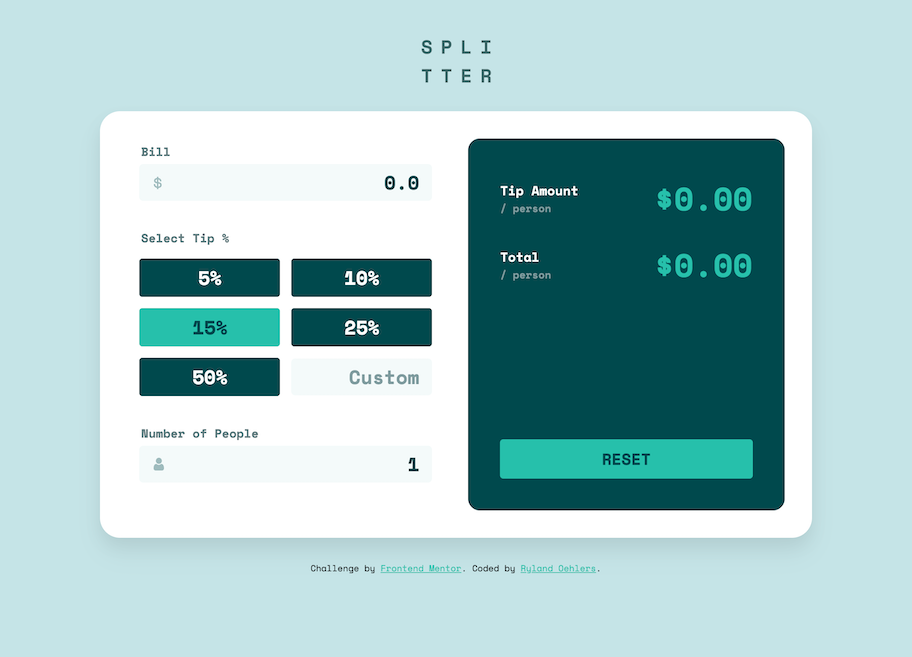
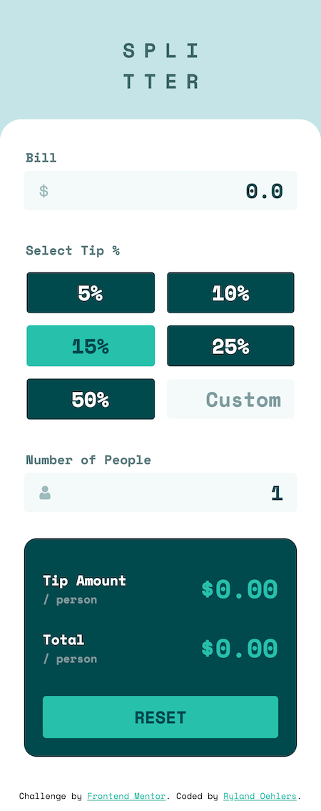

# Frontend Mentor - Tip calculator app solution

This is a solution to the [Tip calculator app challenge on Frontend Mentor](https://www.frontendmentor.io/challenges/tip-calculator-app-ugJNGbJUX). Frontend Mentor challenges help you improve your coding skills by building realistic projects.

## Table of contents

- [Overview](#overview)
  - [The challenge](#the-challenge)
  - [Screenshot](#screenshot)
  - [Links](#links)
- [My process](#my-process)
  - [Built with](#built-with)
  - [What I learned](#what-i-learned)
  - [Continued development](#continued-development)
- [Author](#author)

## Overview

### The challenge

Users should be able to:

- View the optimal layout for the app depending on their device's screen size
- See hover states for all interactive elements on the page
- Calculate the correct tip and total cost of the bill per person

### Screenshot

### Links

- Solution URL: [GitHub Repo](https://github.com/rylandinthesun/tip-calculator-app)
- Live Site URL: [Live Site](https://rylandinthesun.github.io/tip-calculator-app/)

## My process

### Built with

- Semantic HTML5 markup
- SCSS
- Flexbox
- CSS Grid
- Mobile-first workflow
- DOM and JavaScript

### What I learned

This exercise was useful for refreshing my ability of working with JavaScript and the DOM instead of using JS in a framework like React. I had to relearn how to grab certain elements and change the HTML, which I haven't done in a while! Also added to my learning of using SCSS

### Continued development

I feel like it can be easy to want to use a framework for every project when that might not be necessary, especially for a smaller project like this one. It can easily be done with the DOM and a bit of JavaScript for all of the functionality. Don't get me wrong, I love frameworks and also find myself wanting to use them for everything big or small, but I think it's also important to re-familiarize yourself with the DOM and some Vanilla JS to undertand the basics!

## Author

- Website - [Ryland Oehlers](https://www.rylandoehlers.com)
- Frontend Mentor - [@rylandinthesun](https://www.frontendmentor.io/profile/rylandinthesun)
- Twitter - [@rylandinthesun](https://www.twitter.com/rylandinthesun)

